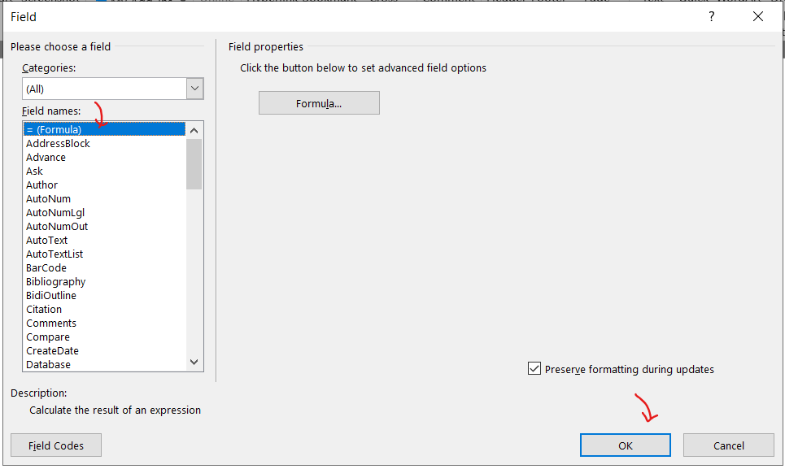
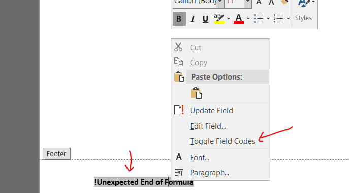
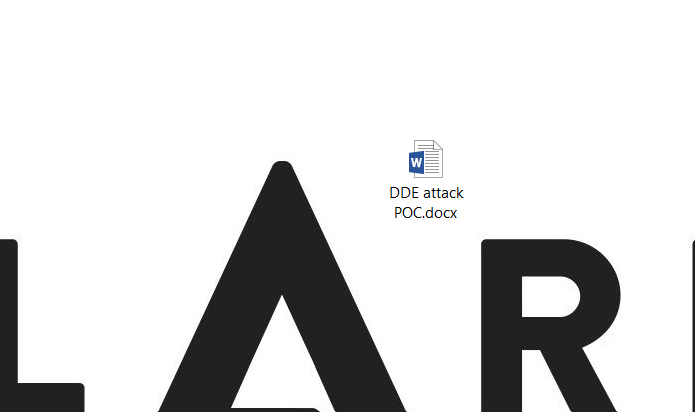
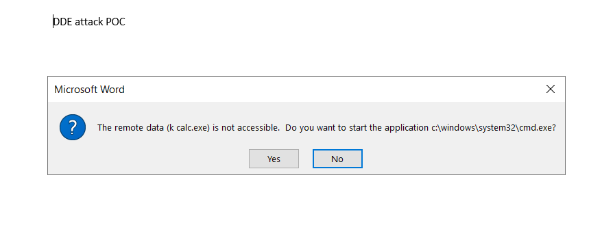
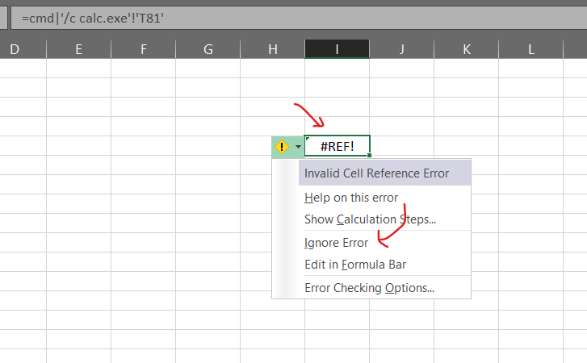
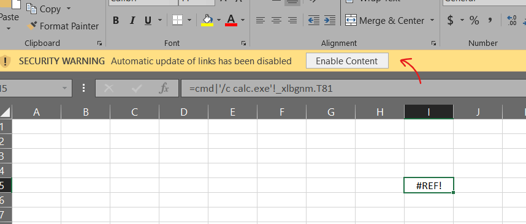
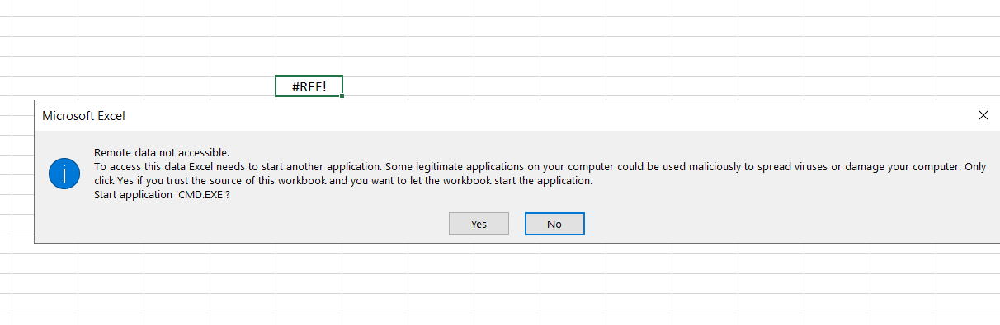
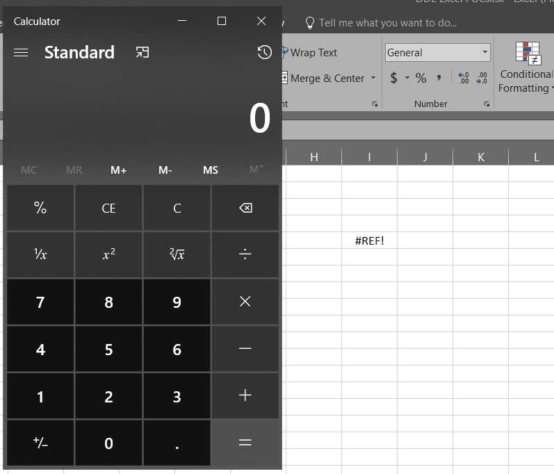
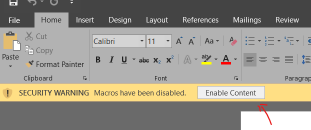
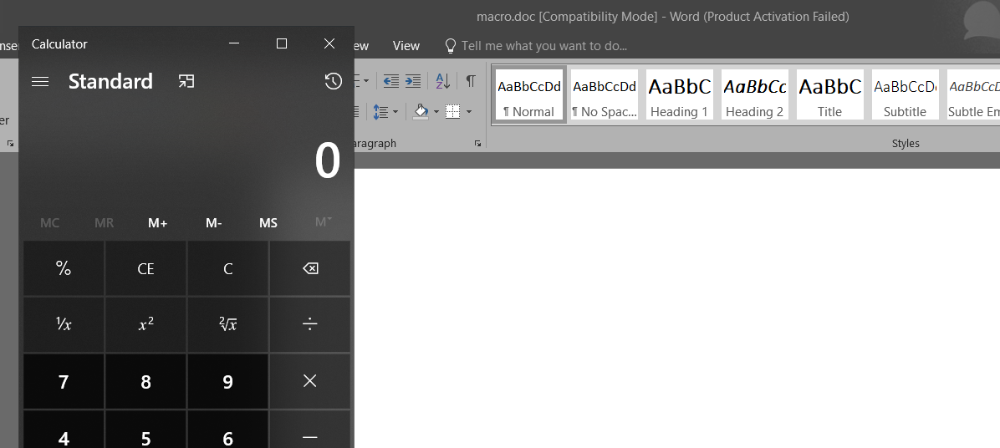

Generously, attacker will use these below techniques in leveraging Microrosft Office feature and vulnerabilities:
1. Exploits
2. Macros
3. Embedded Object
4. Remote injection
and many more...

In this post, we will learn various of techniques how to make a maldocs that can execute code (in our case, we will just run the `calc.exe`). 

Why security researcher always pop-up a `calc.exe` when doing a Proof-of-Concept? Because it is simple an easy. You can always replace the `calc.exe` execution with any payload you want like *Powershell reverse shell* or *mshta fileless* or anything else that suitable your appetite but popping up a `calc.exe` indicated that this things that we play around right now, can also execute anything like download and execute malware. Not just a `calc.exe` execution.

Claim: This is for education only as to understand how maldocs were created by the attacker out there. Do with your own risk.

# DDE attack

Let's start with the DDE attack. This attack was commonly use by attacker out there, where once a victim was phished by clicking the "yes" button in the Warning message by Office, they can immidiately being compromised by the attacker.

DDEAUTO, short for automatic dynamic data exchange, is a command you can put right inside the data of an Office file to get it to pull data out of another file. In our context DDE works by executing command, that will provide the data (data provider).


## Microsoft Word

Go to `Insert` tab -> Click on `Quick Parts` -> Click on `Field`


Let we setup the DDEAUTO payload at footer of our document as victim supposely will not notice it hehe.

Choose `= (Formula)` field names and click `OK` button,



After that, you should see a Field inserted in the document with an error `!Unexpected End of Formula`. Right-click the Field, and choose `Toggle Field Codes`.



The field code now should display `{= \* MERGEFORMAT}`.


Change the field code by manually typing the payload command you want to execute. In our case, we only gonna execute our calculator app.

```
{DDEAUTO c:\\windows\\system32\\cmd.exe "/k calc.exe"  }
```


Save the document.



Let's execute the document. As victim, they will be welcome with these two warning message. By clicking `Yes` on both warning box, our command will be execute!




Calc.exe pop-up!


## Microsoft Excel

In Excel, we can embedded our DDE payload through the use of formulas feature.

Choose a box to put this payload `=cmd|'/c calc.exe'!'T81'` where T81 should be any table column number. Paste in the box and Excel will pop-up a warning. Just ignore it by click `No` for now. 


Then, it will display this `#REF!` text in the box.


Click on the Yellow Warning icon, and choose `Ignore Error`



then save the document.


Open the document and click `Enable Content`.



Click `yes`, and calc.exe will be pop-up!






# Microsoft Word Macro

In malware wild, macro malware is typically transmitted through phishing emails that contain malicious attachments. When the macros run, malware coded into the VBA will begin to infect all files that are opened using Microsoft Office. In our case, we will only execute a `calc.exe` app.

Click on 'view" tab


Click Macros


Type any name you want for Macro name and click "create" to create the macro


On "Project" path, click ThisDocument


### Execute command

Write our malicious macro code like below

```
Private Sub Document_Open()
Test
End Sub

Private Sub DocumentOpen()
Test
End Sub

Private Sub Auto_Open()
Test
End Sub

Private Sub AutoOpen()
Test
End Sub

Private Sub Auto_Exec()
Test
End Sub

Private Sub Test()
    Shell ("cmd /c calc.exe")
End Sub
```


Save the document as `.doc` or `.docm` and run it!





You can also use other payload command line like powershell etc.


# Excel4Macro

# Template injection

# Inline Shapes

# ACCDE executable

# Embedded object

# PPT Hover over

# RTF

# OLE 

# CVE-2012-0158

# CVE-2017-0199

# CVE-2017-11826

# CVE 2017-11882

# Other abusing tehcniques
